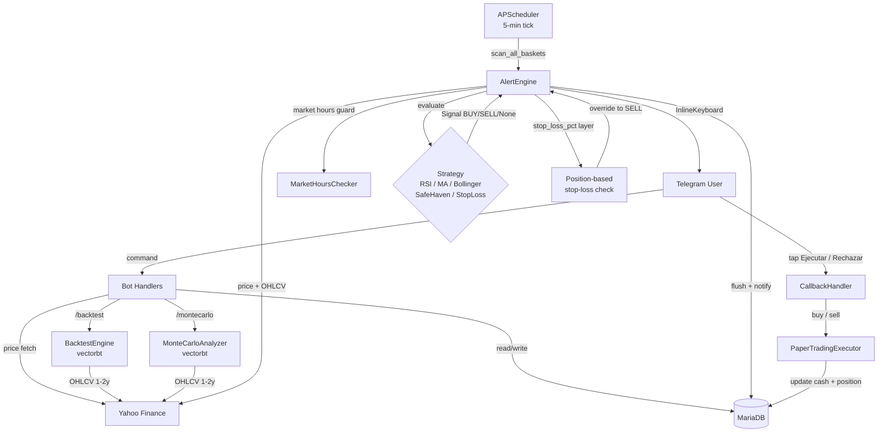

# ScroogeBot — Architecture

## The Problem

Managing a shared investment portfolio in a group chat is messy: people make trades at different times, nobody agrees on when to buy or sell, and nobody has time to watch charts all day. Manual spreadsheets get stale; WhatsApp messages get ignored.

ScroogeBot solves this by creating a **shared paper-trading environment** in Telegram: the group defines baskets, assigns strategies, and the bot monitors positions 24/7. When a strategy fires, every member gets a notification with a single-tap confirm/reject button — no apps to switch, no price to look up.

## The Solution

## Key Decisions

### Why vertical slices instead of horizontal layers?

**Context**: A horizontal approach (models → services → handlers all at once) delays a working bot by weeks.

**Options considered**:
1. Horizontal layers — all DB models, then all services, then all handlers
2. Vertical slices — one complete feature at a time (config → DB → data → one handler group)
3. Prototype-then-refactor — quick hack first, clean later

**Decision**: Vertical slices

**Reasons**:
- Working bot after the first slice; test with real Telegram sooner
- Each slice is independently testable and committable
- Scope creep is bounded per slice

**Trade-off accepted**: Some cross-cutting concerns (auth, error handling) are revisited in multiple slices rather than solved once.

---

### Why `ta==0.11.0` instead of `pandas-ta`?

**Context**: The original spec listed `pandas-ta` for RSI and Bollinger indicators.

**Options considered**:
1. `pandas-ta` — described in spec, functional-style API (`ta.rsi(close, length=14)`)
2. `ta==0.11.0` — class-based API, actively maintained, available on PyPI
3. Calculate indicators manually with pandas rolling

**Decision**: `ta==0.11.0`

**Reasons**:
- `pandas-ta` was removed from PyPI mid-project; pip install fails
- `ta` is its closest functional equivalent with equivalent accuracy
- Class-based API is more explicit and less magic

**Trade-off accepted**: Slightly more verbose: `ta.momentum.RSIIndicator(close=series, window=14).rsi()` vs `ta.rsi(close, length=14)`.

---

### Why notify-before-commit in AlertEngine?

**Context**: AlertEngine must write an Alert row AND send a Telegram message. Order matters.

**Options considered**:
1. Commit then notify — standard pattern; alert persists even if notify fails
2. Notify then commit — alert is created only if notification succeeds

**Decision**: Notify-before-commit (flush → notify → commit)

**Reasons**:
- With commit-then-notify: a Telegram failure leaves alert as PENDING forever; deduplication blocks all future notifications for that position — silent data rot
- With notify-before-commit: a Telegram failure propagates, transaction rolls back, next scheduler tick retries cleanly

**Trade-off accepted**: A partial failure (some members notified, then error on a later member) triggers a rollback. Those members receive a keyboard for a non-existent alert; tapping it shows "Esta alerta ya fue procesada." — a harmless UX quirk.

---

### Why per-basket session isolation?

**Context**: AlertEngine originally passed a single shared session to all basket scans.

**Options considered**:
1. Shared session across all basket scans
2. One session per basket scan (current)
3. One session per position scan (too granular)

**Decision**: One session per basket scan

**Reasons**:
- `session.commit()` inside a loop expires all loaded ORM objects on the shared session → `DetachedInstanceError` on the next iteration
- An error in basket A leaves the shared session in a failed state, tainting baskets B and C
- Per-basket sessions provide fault isolation: basket A failure doesn't affect B or C

**Trade-off accepted**: Slightly higher connection overhead; acceptable at 5-minute intervals.

---

## Data Flow

### User command flow

1. **Telegram → CommandHandler**: python-telegram-bot routes the update to the matching `cmd_X` coroutine.
2. **Handler → DB**: Handler opens a session via `async_session_factory()`, executes SQLAlchemy queries, returns response.
3. **Handler → Yahoo Finance**: For price/OHLCV commands (`/compra`, `/analiza`), `YahooDataProvider` is called synchronously inside the async handler (yfinance is not async-native; I/O is fast enough to not block).
4. **Handler → Telegram reply**: `update.message.reply_text()` or `msg.edit_text()`.

### Automatic alert flow

1. **APScheduler tick**: `AsyncIOScheduler` calls `alert_engine.scan_all_baskets()` every `interval_minutes`.
2. **Basket list**: short-lived session fetches active baskets, session closes.
3. **Per-basket scan**: new session opens; positions with `quantity > 0` fetched with Asset join.
4. **Strategy evaluation**: `YahooDataProvider.get_current_price()` + `get_historical(period="3mo", interval="1d")` → `strategy.evaluate(ticker, df, price)` → `Signal | None`.
4b. **Stop-loss layer**: if `basket.stop_loss_pct` is set and position is down ≥ threshold from `pos.avg_price`, signal is overridden to SELL (independent of strategy result).
5. **Deduplication**: skip if a PENDING Alert already exists for `(basket_id, asset_id)`.
6. **Flush**: new Alert rows inserted and flushed (IDs assigned, not committed).
7. **Notify**: `_notify()` queries BasketMember+User, builds Markdown message, sends InlineKeyboard to each `user.tg_id`.
8. **Commit**: session committed (or rolled back on notify failure).

### Trade confirmation flow

1. **User taps button**: `CallbackQueryHandler` receives `alert:confirm:<id>` or `alert:reject:<id>`.
2. **Answer**: `query.answer()` immediately acknowledges the tap (required within 30s).
3. **Load alert**: `session.get(Alert, alert_id)` — returns early if already processed.
4. **Auth check**: verify user is a basket member.
5. **Execute**: `PaperTradingExecutor.buy/sell()` — updates `Basket.cash`, `Position.quantity/avg_price`, inserts `Order` row with `triggered_by=alert.strategy`.
6. **Resolve**: `alert.status = "CONFIRMED"`, `resolved_at = now()`, commit.
7. **Edit message**: replace keyboard with result text.

---

## Main Components

### `src/bot/bot.py` — Application wiring

**Responsibility**: Assembles the Telegram Application, registers all handler groups, wires AlertEngine + APScheduler, starts polling.

**Inputs**: Settings (token), handler functions, AlertEngine instance

**Outputs**: Running Telegram bot + background scheduler

**Dependencies**: All handler modules, AlertEngine, APScheduler

---

### `src/alerts/engine.py` — AlertEngine

**Responsibility**: Scans positions against strategies on a schedule; applies independent stop-loss layer; creates Alert rows; notifies basket members via Telegram inline keyboard.

**Inputs**: Active baskets + positions (DB), live price + OHLCV (Yahoo Finance)

**Outputs**: Alert rows in DB, Telegram messages with InlineKeyboard

**Dependencies**: YahooDataProvider, Strategy implementations, async_session_factory, Telegram app

**Stop-loss layer**: after `strategy.evaluate()`, if `basket.stop_loss_pct` is set and `(current_price - pos.avg_price) / pos.avg_price ≤ -threshold`, the signal is overridden to SELL regardless of what the strategy returned. Uses `pos.avg_price` (real entry price) not period-open.

---

### `src/strategies/` — Strategy framework

**Responsibility**: Evaluate whether a position should trigger a BUY or SELL signal given current price and historical data.

**Interface**: `Strategy.evaluate(ticker, data: pd.DataFrame, current_price: Decimal) → Signal | None`

**Current implementations**:
- `StopLossStrategy`: exit-only, always-invested mode — used in backtest/montecarlo as a baseline; in AlertEngine generates SELL when price falls below a rolling low (uses period-open, not avg_price)
- `MACrossoverStrategy`: BUY on fast-MA (20d) crossing above slow-MA (50d); SELL on crossing below
- `RSIStrategy`: BUY when RSI(14) < 30 (oversold); SELL when RSI(14) > 70 (overbought)
- `BollingerStrategy`: BUY when price touches lower band; SELL when price touches upper band
- `SafeHavenStrategy`: SELL if drawdown from 52w high exceeds threshold (capital preservation)

**Independent stop-loss layer (not a strategy)**: `Basket.stop_loss_pct` configures a position-based safety floor that AlertEngine applies *on top of any strategy* using `Position.avg_price` as the reference price. This overrides even a BUY signal. Set per basket via `/estrategia` or `/nuevacesta`.

**Adding a new strategy**: one file + one line in `STRATEGY_MAP` in `alerts/engine.py`, `backtest/engine.py`, `backtest/montecarlo.py`, and each handler.

---

### `src/orders/paper.py` — PaperTradingExecutor

**Responsibility**: Execute paper trades — deduct/add cash, update position avg_price, insert Order row.

**Signature**: `buy/sell(session, basket_id, asset_id, user_id, ticker, qty, price, triggered_by="MANUAL") → Order`

**Inputs**: Open DB session, trade parameters

**Outputs**: Updated Basket.cash, Position row, new Order row

**Validation**: raises `ValueError` on insufficient cash or no position to sell

---

### `src/data/yahoo.py` — YahooDataProvider

**Responsibility**: Fetch live prices and OHLCV history from Yahoo Finance.

**Methods**:
- `get_current_price(ticker)` → `PriceResult(price, currency)`
- `get_historical(ticker, period, interval)` → `OHLCVResult(data: DataFrame)`
- `get_fx_rate(from_currency, to_currency)` → `Decimal`

**Note**: yfinance is synchronous — calls block the event loop briefly. Acceptable for low-frequency use; for high-frequency use, wrap in `asyncio.run_in_executor`.

---

### `src/backtest/engine.py` — BacktestEngine

**Responsibility**: Run a historical simulation of a strategy on a single ticker using vectorbt.

**Signature**: `run(ticker, strategy, strategy_name, period, stop_loss_pct=None) → BacktestResult`

**Inputs**: Ticker symbol, Strategy instance, period string (`1y`, `2y`, …), optional stop_loss_pct

**Outputs**: `BacktestResult(total_return_pct, benchmark_return_pct, sharpe_ratio, max_drawdown_pct, n_trades, win_rate_pct)`

**Notes**: Uses `asyncio.run_in_executor` from handler (yfinance + vectorbt are synchronous). Passes `sl_stop=stop_loss_pct/100` to vectorbt when configured. For exit-only strategies (StopLoss), uses `_make_entries_for_exit_only` to always-invest: enter at warmup bar, re-enter day after each exit.

---

### `src/backtest/montecarlo.py` — MonteCarloAnalyzer

**Responsibility**: Bootstrap-resample historical returns to generate N simulated price paths; run strategy on each; aggregate statistics.

**Signature**: `run_asset(ticker, strategy, strategy_name, hist_df, n_sims, horizon, rng, seed, stop_loss_pct=None) → AssetMonteCarloResult`

**Inputs**: Historical OHLCV DataFrame (2y), number of simulations (max 500), horizon days (max 365), seeded RNG

**Outputs**: `AssetMonteCarloResult` with percentile returns, VaR/CVaR, max drawdown, Sharpe, win rate, and profile label

**Notes**: Paths are built by sampling daily returns with replacement (stationary distribution assumption). Correlations between assets are not modelled — stated in footer warning.

---

### `src/sizing/engine.py` — SizingEngine

**Responsibility**: Calculate position size given a risk budget, stop-loss level, and broker commission model.

**Inputs**: Ticker, stop-loss price (manual or ATR×2), capital (from active basket cash), broker commission config

**Outputs**: Number of shares, nominal position, risk amount, commission estimate, limiting factor (risk vs max-position)

**Notes**: Handles USD→EUR conversion via `YahooDataProvider.get_fx_rate`. Max risk = 0.75% of capital; max position = 20% of capital.

---

### `src/db/models.py` — ORM Models

**10 tables**:

| Table | Key columns | Purpose |
|-------|-------------|---------|
| `users` | tg_id, username, first_name, **active_basket_id** | Telegram user registry; active_basket_id persists `/sel` selection |
| `baskets` | name, strategy, risk_profile, cash, broker, **stop_loss_pct** | Shared investment basket; stop_loss_pct = optional position risk floor |
| `basket_members` | basket_id, user_id, role | OWNER/MEMBER access control |
| `assets` | ticker, market | Tracked instruments |
| `basket_assets` | basket_id, asset_id, active | Which assets belong to which basket (model baskets); personal baskets use positions |
| `positions` | basket_id, asset_id, quantity, avg_price | Current holdings |
| `orders` | basket_id, asset_id, user_id, side, qty, price, triggered_by | Trade history |
| `alerts` | basket_id, asset_id, strategy, signal, status, reason | Strategy alert lifecycle |
| `watchlist` | ticker, name, note, status, added_by | Personal watchlist entries |
| `command_logs` | tg_id, username, command, success | Audit trail for all bot commands |
