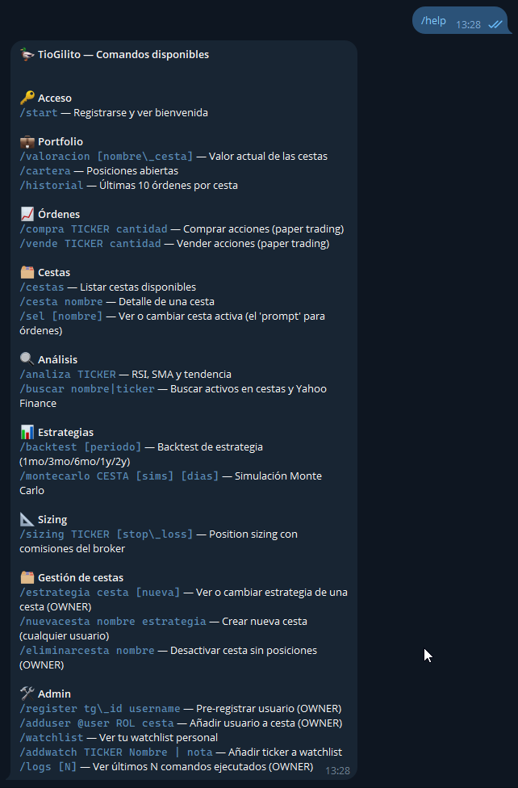
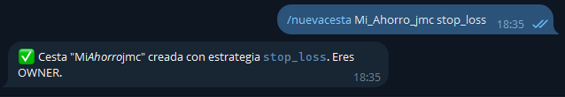
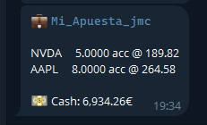

# Guía de Inicio: Aprende a invertir con TioGilito

*Una hora. Dos cestas. Tus primeros pasos en el mundo de la inversión.*

---

## Antes de empezar — La historia de Álvaro


Álvaro tiene 32 años, trabaja en Madrid y acaba de revisar su cuenta bancaria: €10.000 parados generando un 0,01% de interés anual. Mientras tanto, la inflación le come un 2-3% al año de poder adquisitivo. En términos reales, Álvaro está **perdiendo ~€250 al año sin hacer absolutamente nada**.

Un amigo le habla de un bot de Telegram para aprender a invertir sin arriesgar dinero real. Aquí empieza su historia. Y la tuya.

### ¿Qué es el paper trading?

> 📚 **Paper trading** significa operar con dinero ficticio: el bot simula compras y ventas reales usando precios de mercado actuales, pero sin mover un euro real. Es la forma más segura de aprender — te equivocas gratis. Cuando te sientas cómodo, puedes replicar la estrategia en un broker real.

### Qué vas a aprender en esta guía

Al terminar esta guía (~1 hora) vas a saber:

- ✅ Crear y gestionar cestas de inversión diversificadas
- ✅ Buscar activos (acciones, ETFs) y analizarlos técnicamente
- ✅ Entender qué son el RSI, las medias móviles y el stop loss
- ✅ Comparar estrategias con datos históricos (backtest)
- ✅ Usar simulaciones de Monte Carlo para visualizar el riesgo
- ✅ Calcular cuánto comprar sin arriesgar más de lo que puedes permitirte

---

## Paso 0 — Registro

Escribe en el bot:

```
/start
```

<!-- 📸 Captura: respuesta del bot al /start mostrando bienvenida -->


Si es tu primera vez, el bot te registrará automáticamente. Si te pide que contactes al administrador, dile tu ID de Telegram (el bot te lo mostrará).

Una vez dentro, explora los comandos disponibles:

```
/help
```


---

## Módulo 1 — Tu primera cesta: *"Mi_Ahorro"* 🛡️

### 1.1 ¿Qué es una cesta?

> 📚 Una **cesta** es una cartera de valores: una colección de acciones y activos que gestionas juntos. Tener varios activos distintos se llama **diversificar**, y es uno de los principios fundamentales de la inversión: si un sector cae, los demás amortiguan el golpe. "No pongas todos los huevos en la misma cesta" no es solo un dicho — es matemáticamente correcto.

Vamos a crear una cesta conservadora, pensada para preservar capital. La llamaremos *Mi_Ahorro*.

### 1.2 Crear la cesta

```
/nuevacesta Mi_Ahorro stop_loss
```



El bot te confirma que eres el OWNER de la cesta y que tiene **€10.000 de capital inicial** para operar.

### 1.3 La estrategia stop_loss

> 📚 **Stop loss** (literalmente "parar la pérdida") es una regla automática: si una acción cae más de un porcentaje predefinido desde el precio de compra, el bot te avisa para venderla. Es la **red de seguridad** del inversor conservador — limita las pérdidas antes de que se hagan grandes. Funciona especialmente bien con activos estables con dividendo, donde no esperas grandes oscilaciones pero quieres protegerte si algo va muy mal.

Las cestas se crean sin stop loss por defecto. Puedes configurarlo directamente al crear la cesta — por ejemplo un 10%:

```
/nuevacesta Mi_Ahorro stop_loss 10
```

O si ya tienes la cesta creada, puedes añadir o cambiar el stop loss con:

```
/estrategia Mi_Ahorro 10
```

Y para desactivarlo (volver a sin stop loss):

```
/estrategia Mi_Ahorro 0
```

### 1.4 Buscar y añadir activos

Ahora vamos a encontrar cuatro activos para nuestra cesta conservadora. Usaremos `/buscar` — no hace falta saber el ticker de memoria:

```
/buscar iberdrola
```

<!-- 📸 Captura: /buscar iberdrola mostrando IBE.MC como primer resultado con nombre, exchange y tipo -->


El bot te devuelve **IBE.MC** — Iberdrola, empresa española de utilities (electricidad y gas). Está varias veces en nuestras cestas modelo, es un activo muy común. 
Las utilities son activos muy estables: poca volatilidad, buen dividendo histórico. Perfectas para una cesta conservadora.

```
/buscar santander
```

Aparece **SAN.MC** — Banco Santander. Un banco con dividendo histórico, más volátil que una utility pero bien establecido a nivel global.

```
/buscar gold
```

Aparece **GLD** — un ETF que replica el precio del oro.

> ⚠️ Yahoo Finance usa nombres en inglés. Para buscar activos en español no siempre funciona: busca `gold` (no `oro`), `silver` (no `plata`), `oil` (no `petróleo`), etc. Si ya conoces el ticker, búscalo directamente: `/buscar GLD`.

> 📚 Un **ETF** (Exchange-Traded Fund) es un fondo que cotiza en bolsa como una acción normal. En lugar de comprar acciones de una empresa, compras un "paquete" que replica un índice o un activo (como el oro o el S&P 500). Misma liquidez que una acción, mayor diversificación con una sola compra. El oro es el **activo refugio** clásico: cuando los mercados caen y el pánico se extiende, los inversores compran oro, que tiende a subir.

```
/buscar microsoft
```

Aparece **MSFT** — Microsoft. Tecnología de gran capitalización: más volátil que una utility, pero con décadas de historia, dividendo creciente y posición dominante en la nube.

### 1.5 Seleccionar la cesta y comprar

Antes de comprar, dile al bot en qué cesta quieres operar. Es como el "prompt" de tu terminal:

```
/sel Mi_Ahorro
```

El bot confirma: *🗂 Cesta activa: Mi_Ahorro*. Ahora todas las órdenes irán a esta cesta:

```
/compra IBE.MC 20
/compra SAN.MC 15
/compra GLD 5
/compra MSFT 3
```

### 1.6 Analizar un activo: RSI y medias móviles

```
/analiza IBE.MC
```

<!-- 📸 Captura: /analiza IBE.MC mostrando precio, cambio 1d, SMA20, SMA50, tendencia y RSI -->


> 📚 El **RSI (Relative Strength Index)** es un indicador de momento que mide si un activo está "sobrecomprado" o "sobrevendido". Va de 0 a 100:
>
> - **RSI > 70**: todo el mundo quiere comprar — el activo puede estar caro. Señal de precaución.
> - **RSI < 30**: nadie quiere — el activo puede estar barato. Posible oportunidad de entrada.
> - **RSI entre 30-70**: zona neutral, sin señal clara.
>
> Las **medias móviles (SMA20 y SMA50)** suavizan el precio para mostrar la tendencia. Si el precio está por encima de ambas medias, la tendencia es alcista. Si SMA20 > SMA50, el corto plazo es más fuerte que el largo.

> ⚠️ En tendencias fuertes, como por ejemplo NVIDIA cuando el boom de las GPU, el RSI puede permanecer en zona alta durante semanas: topdo el mundo quiere comprar — no es automáticamente señal de venta, a veces conviene esperar, pero eso ya es lectura del mercado.

### 1.7 Ver tu cartera

```
/cartera
```

<!-- 📸 Captura: /cartera mostrando posiciones de Mi_Ahorro con cantidades y precio medio -->


Ves tus posiciones: cuántas acciones de cada activo y a qué precio medio las compraste. El bot calcula automáticamente el cash restante.

---

## Módulo 2 — Tu segunda cesta: *"Mi_Apuesta"* 🚀

### 2.1 El dilema de Álvaro


*Álvaro mira su cesta conservadora y mueve sus tres brazos (si, a efectos de este curso, Alvaro tiene tres brazos). Iberdrola y el oro no le van a hacer rico en poco tiempo. Pero le han dicho que NVIDIA ha multiplicado su precio varias veces en pocos años. ¿No estará dejando dinero sobre la mesa?*

> 📚 **Riesgo y rentabilidad son inseparables.** Iberdrola puede darte un 6-8% anual con poca volatilidad — dormir tranquilo. NVIDIA puede darte un 80%... o hacerte perder un 40% en cuestión de meses. No existe ningún activo que dé más rentabilidad sin más riesgo: si existiera, todos lo comprarían instantáneamente hasta que dejara de ser una ganga. La clave no es evitar el riesgo — es **entenderlo, medirlo y decidir cuánto puedes asumir**.

Vamos a crear una segunda cesta más agresiva para ver la diferencia en la práctica.

### 2.2 Crear la cesta con estrategia RSI

```
/nuevacesta Mi_Apuesta rsi 
```

opcionalmente le podemos añadir un stop loss de un 8% con:
```
/nuevacesta Mi_Apuesta rsi 8
```
### 2.3 La estrategia RSI

> 📚 La **estrategia RSI** es contraintuitiva: compra cuando nadie quiere el activo (RSI < 30, sobrevendido) y vende cuando todos lo quieren (RSI > 70, sobrecomprado). Es una estrategia de **reversión a la media**: apuesta a que los extremos de precio son temporales y el activo volverá a su valor "normal". Funciona mejor en activos volátiles con tendencia histórica clara — exactamente el perfil de las grandes tecnológicas, que oscilan mucho pero mantienen tendencia alcista de fondo.

### 2.4 Añadir activos de crecimiento

```
/buscar nvidia
```

**NVDA** — NVIDIA Corporation. Líder en chips de inteligencia artificial. Alta volatilidad, alto potencial. El tipo de activo donde la estrategia RSI tiene más sentido.


```
/buscar apple
```

**AAPL** — Apple. Gran capitalización tecnológica con ecosistema único. Algo menos volátil que NVIDIA pero con mucho más recorrido que una utility.

```
/sel Mi_Apuesta
/compra NVDA 5
/compra AAPL 8
```

### 2.5 Comparar el RSI de dos activos muy distintos

```
/analiza NVDA
```

<!-- 📸 Captura: /analiza NVDA mostrando precio, RSI (probablemente alto) y SMA — contraste con IBE -->


Fijemonos en la línea **ATR (14)** — el porcentaje que oscila de media el activo cada día. Es la medida más directa de volatilidad que puedes leer sin salir del chat.

Compara ahora la salida de `/analiza` entre los dos activos:

| | IBE.MC (Iberdrola) | NVDA (NVIDIA) |
|---|---|---|
| ATR (14) típico | `0.6% — volatilidad baja 🟢` | `3.2% — volatilidad alta 🔴` |
| RSI típico | Oscila suavemente entre 40-60 | Puede alcanzar 80+ o caer a 20 |
| Estrategia natural | Stop loss (proteger lo ganado) | RSI (aprovechar los extremos) |
| Perfil inversor | Conservador | Tolerante al riesgo |

*Si el RSI de NVDA estuviera ahora en 72, la estrategia RSI **no habría comprado** — esperaría a que bajara a 30. Esto es exactamente lo que hace el bot automáticamente cuando las alertas están activas: vigila por ti.*

### 2.6 El problema oculto de la diversificación: correlación

Álvaro mira su cesta *Mi_Apuesta* satisfecho: tiene NVIDIA y Apple. Dos empresas distintas.
Dos activos distintos. ¿Está diversificado?

No del todo.

> 📚 La **correlación** mide cómo se mueven dos activos entre sí. Va de -1 a +1:
>
> - **Correlación +1**: se mueven exactamente igual. Si uno cae un 5%, el otro también.
>   Tener los dos no añade ninguna protección.
> - **Correlación 0**: se mueven de forma independiente. La caída de uno no dice nada
>   sobre el otro.
> - **Correlación -1**: se mueven en sentido opuesto. Cuando uno cae, el otro sube.
>   La diversificación perfecta (rara en la práctica).
>
> NVIDIA y Apple tienen una **correlación alta** (~0.7-0.8 históricamente): ambas son
> tecnológicas americanas de gran capitalización. En una crisis del sector tech — como
> la de 2022, cuando el Nasdaq cayó un 33% — caen juntas y al mismo tiempo.
>
> Por eso *Mi_Ahorro* está mejor diversificada que parece: IBE.MC (utility europea),
> SAN.MC (banca española), GLD (oro, correlación negativa con renta variable en crisis)
> y MSFT (tech americana) tienen correlaciones mucho más bajas entre sí. Cuando las
> tecnológicas caen, el oro típicamente sube. Cuando la banca europea sufre, las
> utilities resisten mejor.
>
> **La lección práctica**: diversificar no es tener muchos activos — es tener activos
> que no caigan todos a la vez por la misma razón.


### 2.7 ¿Cuánto comprar? Position sizing y Stop Loss

Antes de invertir en algo volátil, la pregunta crucial no es "¿cuánto puede subir?" sino "¿cuánto puedo perder?".

Una estrategia básica que se tiene en bolsa es stop loss/take profit (puedes elegirla para tu cartera). Es establecer con que precios límite decides vender un activo bien para controlar la perdida bien para asegurar la ganancia. Si un activo baja del precio stop loss: la venta debe ser inmediata. Lo mismo si pasa del take profit (no sea que caiga instantes despues). Aunque no se use esta estrategia es la base del sizing para determinar cuanto comprar de cada activo en tu cartera

```
/sizing NVDA
```

> 📚 El **position sizing** (dimensionamiento de posición) calcula el número máximo de acciones que puedes comprar para que, si la operación sale mal y el stop loss se activa, la pérdida total no supere un porcentaje fijo de tu cartera. Es la diferencia entre un inversor disciplinado y alguien que se lo juega todo a una carta.

El bot responde algo así:

```
📊 Position Sizing — NVIDIA Corporation (NVDA)

Precio actual:      €875,32
Stop loss:          €837,18  (ATR×2)
  └─ ATR(14):       €19,07  |  Volatilidad media
Distancia al stop:  €38,14 (-4,36%)

Acciones:           3  (limitado por riesgo)
Posición nominal:   €2.625,96 (13,13% de cartera)
Riesgo máximo:      €150,00 (0,75%)

Comisiones (paper): €0,00 compra + €0,00 venta
Riesgo real:        €114,42

✅ Stop dentro del rango recomendado
```

**Qué significa cada línea:**

| Campo | Significado |
|---|---|
| **Precio actual** | Cotización en tiempo real, convertida a € si el activo cotiza en otra divisa |
| **Stop loss (ATR×2)** | Nivel de precio al que venderías si la operación sale mal. Automático: precio − 2×ATR (movimiento diario típico x 2 para dar margen) |
| **ATR(14)** | *Average True Range* a 14 días: el movimiento diario típico del activo. A más volátil, stop más alejado. |
| **Distancia al stop** | Cuánto puede caer el precio antes de que vendas. En € y en % |
| **Acciones** | Cuántas acciones comprar. "limitado por riesgo" = es el riesgo lo que te frena, no el tamaño |
| **Posición nominal** | Coste total de la compra (acciones × precio) |
| **% de cartera** | Qué porcentaje del capital total representa esta posición |
| **Riesgo máximo** | El máximo que el bot te deja perder: 0,75% del cash de tu cesta activa |
| **Comisiones** | Lo que cobran compra + venta estimadas. Cambia según el broker de la cesta |
| **Riesgo real** | Pérdida real si salta el stop: (acciones × distancia) + comisiones |

**¿Qué capital usa el bot para calcular?**

El bot usa el **cash disponible de la cesta activa** (la que hayas seleccionado con `/sel`). La primera línea del resultado siempre muestra qué cesta y qué capital está usando. Si no tienes ninguna cesta activa, te avisa y aplica un capital de referencia genérico.

**El stop loss: automático o manual**

Por defecto, el bot coloca el stop a **2×ATR por debajo del precio**. El ATR mide cuánto se mueve el activo en un día normal: multiplicar por 2 da un margen suficiente para que la volatilidad habitual no dispare el stop accidentalmente.

Puedes pasar stop y/o capital explícitamente:

```
/sizing NVDA 840            ← stop manual en 840, capital del cash de tu cesta
/sizing NVDA 840 8000       ← stop manual + capital fijo de €8.000
```

Si pasas capital explícito como tercer argumento, el bot lo usa en lugar del cash de la cesta activa.

**¿Cuándo sale "limitado por nominal" en vez de "por riesgo"?**

El bot aplica dos límites a la vez: el riesgo máximo (0,75% de cartera) y el tamaño máximo de posición (20% de cartera). Si con el stop muy cercano el cálculo de riesgo te permitiría comprar demasiadas acciones, el límite de posición se activa primero y el campo muestra `limitado por nominal`.

**Avisos posibles:**

- *Stop muy alejado (X%)*: el stop está más del 15% por debajo del precio. La posición resultante sería tan pequeña que apenas vale la pena. Considera usar el stop automático ATR.
- *Precio convertido desde USD*: el activo cotiza en dólares; el bot ha aplicado el tipo de cambio EUR/USD.
- *Riesgo insuficiente para esta distancia de stop*: el stop está tan lejos que ni siquiera 1 acción cabe dentro del límite de riesgo. La posición sale a 0 acciones.

- *stop loss debe ser inferior al precio actual*: se ha metido un stop loss muy alto. Puedes usar el stop automático ATR o fijarlo manualmente mas bajo.

---

---

## Interludio — Cuándo están abiertos los mercados 🕐

Antes de que el bot te envíe tu primera alerta automática, un detalle práctico que evita confusiones:

> 📚 Los mercados financieros tienen **horarios de apertura** distintos según el país.
> Las cotizaciones solo se actualizan cuando el mercado correspondiente está abierto.
> Fuera de ese horario, el precio que ves es el último precio de cierre — no refleja
> lo que está pasando en ese momento.

| Mercado | Horario (hora española peninsular) | Activos |
|---|---|---|
| **BME** (Bolsa Madrid) | 9:00 — 17:30 | IBE.MC, SAN.MC y otros `.MC` |
| **NYSE / NASDAQ** | 15:30 — 22:00 | NVDA, AAPL, MSFT, GLD |
| **LSE** (Londres) | 9:00 — 17:30 | Activos `.L` |

En verano los horarios americanos se adelantan una hora por el cambio horario en EEUU.

**Lo que esto significa para ti con el bot:**

- Una alerta que llega a las 23:00 sobre un activo americano puede ser legítima — el mercado todavía está abierto.
- Una alerta sobre Iberdrola a las 20:00 no puede ejecutarse a precio de mercado — BME ya cerró. El bot opera con el precio de Yahoo Finance, que fuera de horario  devuelve el último cierre.
- Los fines de semana todos los mercados están cerrados. Las alertas que lleguen entonces reflejan precios del viernes.

> ✅ El bot respeta los horarios de mercado: el escáner se salta automáticamente
> cuando todos los mercados están cerrados, y omite cada activo individualmente
> cuando su mercado específico está cerrado. Además, si recibes una alerta del
> viernes y pulsas ✅ el sábado, el bot te avisará de que el mercado está cerrado
> y la alerta quedará pendiente hasta que puedas confirmarla en horario de mercado.
> Las alertas cuya condición haya desaparecido (el precio se ha recuperado desde
> el viernes) se marcan automáticamente como expiradas en el siguiente escaneo.

---

## Módulo 3 — La Máquina del Tiempo: Backtest ⏪

### 3.1 ¿Qué es el backtest?

> 📚 El **backtest** responde a una pregunta fascinante: *"¿y si hubiera aplicado esta estrategia el año pasado?"*. El bot descarga los precios históricos de cada activo, simula todas las señales de compra/venta que habría generado tu estrategia, y calcula el resultado real. **No predice el futuro** — el pasado no se repite de forma idéntica — pero sirve para descartar estrategias claramente malas y entender cómo se comportan bajo distintas condiciones de mercado (tendencias, laterales, crisis).

### 3.2 Ejecutar el backtest
El backtest usa capital inicial de €10.000, estrategia stop_loss en modo "siempre invertido" (entras al día 60, vuelves a entrar el día siguiente a cada salida).

```
/backtest 1y
```

<!-- 📸 Captura: /backtest 1y mostrando resultados de ambas cestas (Mi_Ahorro y Mi_Apuesta) -->


El bot te puede mostrar los resultados de ambas cestas (tienes que cambiar entre ellas con /sel). Aprende a leer estas cuatro métricas:

**Rentabilidad vs B&H y Alpha (α)**
La estrategia frente a "simplemente haber comprado y no haber tocado nada" (Buy & Hold). El **alpha** es la diferencia — lo que añade (o resta) la estrategia activa respecto a no hacer nada.

**Ratio de Sharpe**
Rentabilidad dividida por volatilidad. Un Sharpe de 1,0 es bueno; por encima de 1,5 es excelente. Dos estrategias pueden tener la misma rentabilidad: la que tenga mayor Sharpe lo ha conseguido con menos sustos por el camino.

**Máximo Drawdown**
La caída máxima desde un pico hasta el valle más profundo. Si es -35%, en algún momento habrías visto tu cartera perder un 35% de valor. Pregúntate honestamente: **¿habría aguantado sin vender en pánico?** Vender en el momento de pánico es el error más frecuente del inversor novato.

**Win rate**
Porcentaje de operaciones ganadoras. Un 40% de win rate puede ser completamente rentable si las ganancias son 3 veces mayores que las pérdidas. No busques ganar siempre — busca que las ganancias superen a las pérdidas en conjunto.

Expliquemos un caso con detalle, la cesta de stop loss: 

**Backtest: Mi_Apuesta_jmc (1y)**
   Estrategia: rsi

**NVDA**
  Rentabilidad: +32.6%  (B&H: +41.2%,  α: -8.7%)
  Sharpe: 1.40  |  Max DD: -19.2%
  Operaciones: 9  |  Win rate: +88%

RSI funcionó razonablemente bien
9 operaciones, 88% de éxito → RSI identificó bien los momentos de entrada (sobrevendido, RSI<30) y salida (sobrecomprado, RSI>70)

Ganó +32.6% vs B&H +41.2% → se quedó fuera del mercado en algunos tramos donde NVDA siguió subiendo (RSI la consideraba "cara" y la vendía, pero siguió subiendo)

Alpha -8.7%: perdió esa diferencia respecto a simplemente mantener

El punto más importante aquí es el riesgo:

Max DD -19.2% → en el peor momento, la estrategia llegó a estar un 19% por debajo de su pico. NVDA es muy volátil, y RSI no te protege de grandes caídas dentro de cada tramo en que estás dentro

Sharpe 1.40 → aceptable, pero no tan eficiente como los resultados de Mi_Ahorro con IBE/GLD

Conclusión NVDA: RSI capturó el 79% de la subida del año (32.6/41.2), con riesgo notable. No es mala lectura para un activo tan volátil.

**AAPL**
  Rentabilidad: +1.9%  (B&H: +8.2%,  α: -6.3%)
  Sharpe: 0.29  |  Max DD: -7.9%
  Operaciones: 1  |  Win rate: +0%

resultado peculiar
1 operación, 0% win rate, pero +1.9% — esto parece contradictorio. Lo que probablemente ocurrió:

RSI nunca generó señal de compra clara para AAPL (nunca llegó a RSI<30, no hubo un pánico suficiente)
La lógica "always invested" del backtest entró al día 60 como fallback
RSI generó 1 señal de venta (RSI>70) cerrando esa posición con pérdida → 0% win rate
Re-entró automáticamente al día siguiente
La posición final quedó abierta hasta el fin del año, recuperando algo → +1.9% neto
En otras palabras: AAPL no le dio a RSI buenas oportunidades de entrada ese año. La estrategia estuvo casi siempre en el mercado por defecto, no por señal real.

Sharpe 0.29 es bajo — casi tan malo como no hacer nada con riesgo.

Resumen de esta cartera
Estrategia	B&H	¿Mereció la pena?
NVDA	+32.6%	+41.2%	Razonable — capturó la mayor parte con menos estrés
AAPL	+1.9%	+8.2%	No — RSI no encontró buenas señales
Para Mi_Apuesta_jmc (que intuyo que es la cartera más agresiva/especulativa): RSI no es la estrategia ideal para activos como NVDA o AAPL que suben tendencialmente. RSI es mejor en activos más volátiles y laterales donde sí hay ciclos claros de sobrecompra/sobreventa. Para una apuesta alcista en tecnología, MA Crossover podría ser más apropiada — sigue la tendencia en vez de intentar comprar los mínimos

---

*Álvaro compara: Mi_Apuesta tiene mayor rentabilidad potencial pero un drawdown del -19% y -7%. Mi_Ahorro tiene un drawdown del -7%. Decide que en la vida real usará una estrategia intermedia, y que antes de tocar dinero real necesita entender mejor su propio umbral de tolerancia al dolor.*

---

## Módulo 4 — El Futuro en Probabilidades: Monte Carlo 🎲

### 4.1 Por qué el futuro es una distribución, no un número

> 📚 **Monte Carlo** es una técnica de simulación que genera miles de posibles futuros basándose en la volatilidad histórica del activo. En lugar de decirte *"dentro de un año tendrás X euros"* (imposible de saber), te dice:
>
> *"En el 10% de los peores escenarios tendrás Y€, en el escenario más probable tendrás Z€, y en el 10% de los mejores escenarios tendrás W€."*
>
> Es la herramienta más **honesta** para hablar del futuro: no elimina la incertidumbre, la **cuantifica**. Así puedes tomar decisiones informadas en lugar de imaginar que solo existen el escenario bueno y el catastrófico.

### 4.2 Simular Mi_Apuesta

```
/montecarlo Mi_Apuesta
```

<!-- 📸 Captura: /montecarlo Mi_Apuesta mostrando distribución con percentiles p10/p50/p90 -->


Lee los percentiles:

| Percentil | Significado |
|-----------|-------------|
| **p10** | Escenario pesimista — el 10% de peores simulaciones. Tu suelo probable. |
| **p50** | Escenario mediano — el resultado más frecuente en las simulaciones. |
| **p90** | Escenario optimista — el 10% de mejores simulaciones. Tu techo probable. |

### 4.3 Leer el resultado completo — ejemplo real

Así se ve un Monte Carlo real de una cesta RSI con NVDA y AAPL a 90 días:

```
NVDA
  Rentabilidad
    Mediana:          +0.0%
    Rango 80%:        -3.1% a +20.8%
    Peor caso (5%):   -10.7%  |  Prob. pérdida: 16%
  Riesgo
    VaR 95%: -10.7%  |  CVaR 95%: -21.8%
    Max DD mediano: 0.0%  |  Max DD peor (5%): 23.1%
  Calidad
    Sharpe mediano: 0.00  |  Win rate mediano: 0%
  🔴 Perfil desfavorable, considerar ajustes
```

Esto puede parecer alarmante, pero tiene una explicación lógica. Línea a línea:

**Mediana +0.0% y Win rate 0%** — RSI es una estrategia *selectiva*: solo actúa cuando el indicador llega a extremos (RSI < 30 o > 70). En muchos de los 90 días simulados, esos extremos simplemente no ocurren y la estrategia no opera — la cartera está en cash, retorno = 0%. El win rate 0% no significa que pierda siempre; significa que en la mayoría de simulaciones cortas no hay operaciones que contar.

**Rango 80%: -3.1% a +20.8% (asimetría positiva)** — cuando RSI SÍ genera señal en NVDA, suele ser comprando una caída en un activo de tendencia alcista. El resultado es muy asimétrico: la bajada típica es pequeña (-3%), pero la subida potencial es grande (+20%). Eso es exactamente lo que busca RSI en activos volátiles con tendencia.

**Prob. pérdida 16%** — solo en 16 de cada 100 escenarios se pierde dinero. Es un número razonable: la estrategia tiene más probabilidad de acertar que de perder.

**VaR 95%: -10.7% / CVaR 95%: -21.8%** — estas son las métricas más importantes para gestión del riesgo:
- El *VaR 95%* dice: "en el 95% de los escenarios, no perderás más del 10.7%"
- El *CVaR 95%* dice: "pero en ese 5% de peores casos, perderás de media un 21.8%"
- Para un fondo de €10.000 en NVDA, eso es ~€2.180 de pérdida en escenario catastrófico. ¿Puedes asumir eso?

**Max DD mediano: 0.0% / peor caso: 23.1%** — el drawdown mide la caída desde el máximo. Mediana 0% confirma que en muchos escenarios no se entra nunca (o se entra y sale sin pérdida). El 23.1% en el peor caso es el "pain number": en el escenario catastrófico, en algún momento habrás estado un 23% por debajo del pico.

**🔴 Perfil desfavorable** — se activa cuando Sharpe y Win rate son bajos (en este caso porque la mayoría de simulaciones son de "sin operaciones"). No significa que la estrategia sea mala — significa que en ventanas cortas de 90 días **no produce resultados consistentes**. RSI necesita tiempo para generar ciclos completos de compra/venta; con 90 días muchas veces no le da tiempo.

> 📚 Conclusión práctica: los resultados del Monte Carlo para RSI/90 días dicen "en el escenario típico, la estrategia no actúa y no ganas ni pierdes; pero si actúa, tiene más upside que downside". Aumenta el horizonte (`/montecarlo Mi_Apuesta rsi 250`) para ver cómo evoluciona con más tiempo.

---

**NVDA vs AAPL — ¿cuál tiene mejor perfil?**

Comparando los dos activos de la misma simulación:

| Métrica | NVDA | AAPL |
|---------|------|------|
| Mediana | 0.0% | 0.0% |
| p90 (optimista) | **+20.8%** | +10.9% |
| p10 (pesimista) | -3.1% | **-5.7%** |
| Prob. pérdida | **16%** | 20% |
| CVaR 95% | -21.8% | **-12.0%** |

NVDA tiene más potencial alcista (+20.8% vs +10.9%) pero también más riesgo extremo (CVaR -21.8% vs -12%). AAPL tiene más probabilidad de perder (20% vs 16%) pero las pérdidas son más contenidas. Esto refleja fielmente la naturaleza de cada activo: NVDA es más volátil, AAPL más estable.

*Álvaro ve que en el escenario p10, sus €10.000 en NVDA quedarían en €9.690 (pérdida leve). Pero en el 5% de peores casos podría perder €2.180. Se pregunta: ¿podría vivir con esa pérdida? Sí — no es dinero del alquiler, es ahorro extra. Pero decide que no pondrá más del 20% de sus ahorros totales en Mi_Apuesta. El 80% restante irá a Mi_Ahorro. Eso es **gestión del riesgo real**: no evitar las apuestas audaces, sino limitarlas a lo que puedes permitirte perder.*

---
---

## Módulo 5 — Los errores que vas a querer cometer (y no deberías) ⚠️ 


*Álvaro lleva una hora aprendiendo. Tiene dos cestas, ha visto un backtest y una simulación Monte Carlo. Ahora es exactamente el momento más peligroso: sabe suficiente para sentirse seguro, pero no suficiente para saber lo que no sabe.*

Estos son los errores más frecuentes — no en teoría, sino en la práctica real
de inversores que empezaron exactamente donde tú estás ahora.

---

### Error 1 — Vender en el momento de pánico

El backtest te mostró el **máximo drawdown**: esa caída del -25% en *Mi_Apuesta*.
Un número en pantalla parece manejable. Pero cuando es dinero real y llevas tres semanas viendo cómo tu cartera pierde valor cada día, la presión psicológica es completamente distinta.

> 📚 Los estudios de comportamiento inversor (DALBAR, entre otros) muestran
> consistentemente que el inversor medio obtiene bastante menos rentabilidad que
> el fondo en el que invierte — precisamente porque compra tarde (cuando ya ha
> subido mucho y la euforia es máxima) y vende pronto (cuando cae y el miedo
> es máximo). La estrategia correcta y la psicología humana van en sentido opuesto.

**Cómo practicarlo aquí**: cuando tu cesta de papel trading esté en negativo
durante varios días seguidos, observa cómo te sientes. ¿Tienes ganas de liquidar? Ese impulso — en papel, sin consecuencias — es exactamente lo que tendrás que gestionar con dinero real.

---

### Error 2 — Overtrading: confundir actividad con rentabilidad

La interfaz de comandos hace que operar sea muy fácil. `/compra`, `/vende` — dos segundos. Esa facilidad es una trampa.

> 📚 Cada operación tiene un coste implícito: en un broker real hay comisiones, spread bid-ask, y en algunos países, como España, impacto fiscal por cada plusvalía realizada.
> Pero incluso en papel trading hay un coste invisible: **cada operación es una  decisión que puedes acertar o fallar**. Más operaciones = más oportunidades de equivocarse. 
> Warren Buffett tiene una frase conocida: su horizonte de inversión  favorito es "para siempre". No es una exageración filosófica — es matemática del interés compuesto.

Una señal de alerta personal: si llevas más de 10 operaciones en una semana en una cesta pequeña, es probable que estés operando por ansiedad, no por análisis.

---

### Error 3 — Sobreponderar lo que conoces (sesgo de familiaridad)

Es tentador comprar Iberdrola porque conoces la marca, o NVIDIA porque usas sus tarjetas gráficas, o Apple porque tienes un iPhone. El conocimiento del producto no es conocimiento financiero de la empresa.

> 📚 El **sesgo de familiaridad** hace que los inversores sobreponderen empresas de su país, su sector laboral o su vida cotidiana. Los empleados de Enron  tenían el 60% de sus ahorros para la jubilación en acciones de Enron.
> Conocían la empresa mejor que nadie. Perdieron todo cuando quebró. 
>
> Conocer una empresa como consumidor te dice algo sobre su producto.
> No te dice nada sobre su valoración, su deuda, sus márgenes o su competencia.

**El antídoto**: antes de comprar algo "porque lo conoces", usa `/analiza` y mira los números. Si el RSI está en 78 y llevas meses sin ver una corrección, "conocer la empresa" no es motivo suficiente para comprar ahora.

---

### Error 4 — Ignorar el tamaño de la posición

Has visto `/sizing` en el Módulo 2. Es el comando menos glamuroso del bot y probablemente el más importante.

> 📚 Puedes tener razón en tu análisis — el activo sube exactamente como predijiste — y aun así perder dinero si tenías una posición demasiado grande en algo que bajó antes de subir. El **position sizing** no es sobre ser conservador: es sobre sobrevivir el camino hasta tener razón.
>
> El error clásico del principiante no es equivocarse en la dirección — es no poder aguantar una posición correcta porque el tamaño era tan grande que el drawdown temporal le obligó a salir antes de que el precio se recuperara.

Regla práctica: ninguna posición individual debería representar más del 10-15% de tu cartera total. Con activos volátiles como NVDA, considera bajar ese límite al 5-8%.

---

### Error 5 — Perseguir rentabilidades pasadas

El backtest de *Mi_Apuesta* muestra buenos resultados el último año. NVIDIA subió mucho. La estrategia RSI funcionó bien. Todo esto es verdad.

Y es completamente irrelevante para predecir lo que pasará el año que viene.

> 📚 **"Rentabilidades pasadas no garantizan rentabilidades futuras"** es la advertencia legal que aparece en todo fondo de inversión. No es burocracia — es la verdad más importante de las finanzas. Los fondos que más suben en un año dado son, estadísticamente, peores que la media en los años siguientes (regresión a la media). Comprar lo que ya subió mucho porque "está funcionando" es, con frecuencia, llegar tarde a la fiesta.
>
> El backtest sirve para descartar estrategias claramente malas, no para identificar ganadores futuros.

---

*Álvaro lee esta lista y reconoce al menos tres errores que ya estaba a punto de cometer. Eso es exactamente para lo que sirve el paper trading: equivocarse gratis.*

---

## Módulo 6 — Las Cestas Modelo del Sistema 🗂️

```
/cestas
```

Verás que el sistema incluye 5 **cestas modelo** además de las tuyas:

| Cesta modelo | Estrategia | Filosofía |
|---|---|---|
| Modelo StopLoss | stop_loss | Preservar capital, limitar pérdidas |
| Modelo MA Crossover | ma_crossover | Seguir tendencias largas |
| Modelo RSI | rsi | Aprovechar extremos de momento |
| Modelo Bollinger | bollinger | Operar con la volatilidad |
| Modelo SafeHaven | safe_haven | Activos refugio en crisis |

> 📚 La **media móvil cruzada (MA Crossover)** compara dos medias de distintos periodos: cuando la media rápida (20 días) cruza hacia arriba la media lenta (50 días), es señal de que el momentum cambia a alcista. Es una de las estrategias más veteranas y sencillas — no la más precisa, pero robusta en tendencias largas.
>
> Las **Bandas de Bollinger** definen una "zona normal" alrededor del precio usando la desviación estándar. Cuando el precio toca la banda inferior (muy barato respecto a su media reciente), puede ser señal de compra. Cuando toca la banda superior, posible señal de venta.

Compara el `/backtest 1y` de tu *Mi_Apuesta* con el *Modelo RSI*: si tu cesta bate al modelo, has elegido buenos activos — la estrategia es la misma, así que la diferencia viene de tu selección. Si no lo bate, quizás hay activos más adecuados para esa estrategia.

---

## Cierre — Limpia y empieza de verdad 🧹

### Liquidar las cestas de prueba

Para borrar una cesta, primero hay que cerrar todas sus posiciones. El bot **no permite eliminar cestas con posiciones abiertas** — es una protección deliberada para que no "hagas desaparecer" una posición sin cerrarla explícitamente.

Puedes venderlas una a una:

```
/sel Mi_Ahorro
/vende IBE.MC 20
/vende SAN.MC 15
/vende GLD 5
/vende MSFT 3
```

O usar el atajo que vende todo de una vez (solo el OWNER):

```
/liquidarcesta Mi_Ahorro
/liquidarcesta Mi_Apuesta
```

Ahora sí:

```
/eliminarcesta Mi_Ahorro
/eliminarcesta Mi_Apuesta
```

### Crea tu cesta real

```
/nuevacesta MiCartera stop_loss
```

(o la estrategia que más te haya convencido durante la guía)

Elige tus activos reales con `/buscar`, analízalos con `/analiza` antes de comprar, dimensiona tus posiciones con `/sizing` para no arriesgar más de lo que debes, y deja que el bot vigile por ti mientras tú sigues con tu vida.

Las alertas automáticas del sistema te notificarán cuando una estrategia genere una señal — con botones para **Confirmar** o **Ignorar** la orden sugerida. Tú siempre tienes la última palabra.

---

## ¿Y ahora qué?


- **`/help`** — referencia rápida de todos los comandos
- **[USER_MANUAL.md](USER_MANUAL.md)** — documentación completa con todos los detalles y ejemplos
- Cuando tengas confianza con el paper trading, replica en tu broker real la estrategia que mejor funcione

---

 

*Álvaro cerró el tutorial con sus dos cestas de prueba eliminadas y una tercera — su cesta real — esperándole con €10.000 de capital y la estrategia que mejor encaja con su carácter. Ya no ve el dinero en la cuenta corriente como "ahorros seguros" — lo ve como poder adquisitivo que se erosiona cada año. La diferencia entre saberlo y actuar en consecuencia es exactamente lo que acabas de hacer.*

*Bienvenido al lado racional de la inversión.*
