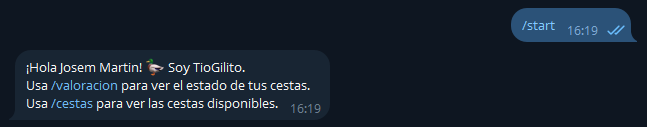
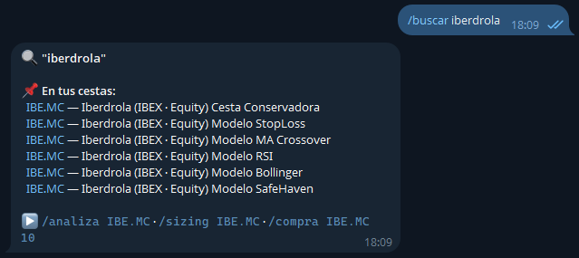
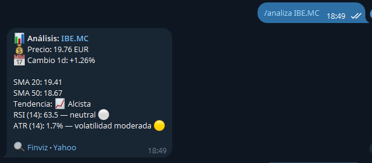
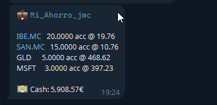
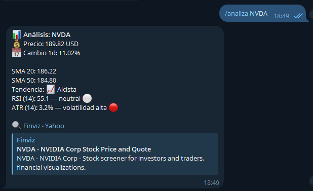
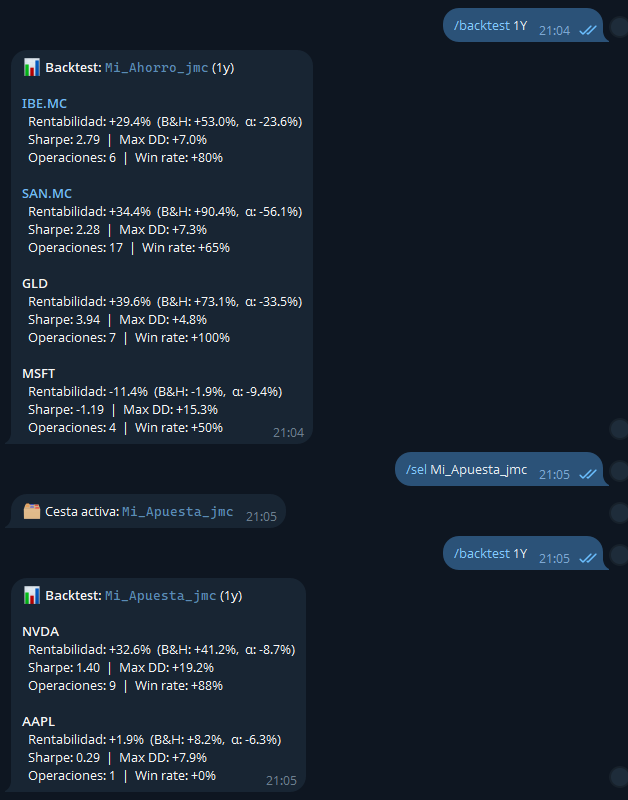
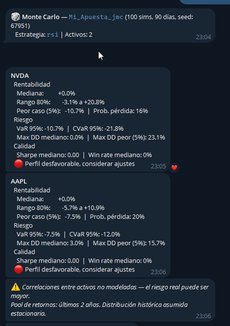

# Guía de Inicio: Aprende a invertir con TioGilito

*Una hora. Dos cestas. Tus primeros pasos en el mundo de la inversión.*

---

## Antes de empezar — La historia de Álvaro


Álvaro tiene 32 años, trabaja en Madrid y acaba de revisar su cuenta bancaria: €10.000 parados generando un 0,01% de interés anual. Mientras tanto, la inflación le come un 2-3% al año de poder adquisitivo. En términos reales, Álvaro está **perdiendo ~€250 al año sin hacer absolutamente nada**.

Un amigo le habla de un bot de Telegram para aprender a invertir sin arriesgar dinero real. Aquí empieza su historia. Y la tuya.

### ¿Qué es el paper trading?

> 📚 **Paper trading** significa operar con dinero ficticio: el bot simula compras y ventas reales usando precios de mercado actuales, pero sin mover un euro real. Es la forma más segura de aprender — te equivocas gratis. Cuando te sientas cómodo, puedes replicar la estrategia en un broker real.

### Qué vas a aprender en esta guía

Al terminar esta guía (~1 hora) vas a saber:

- ✅ Crear y gestionar cestas de inversión diversificadas
- ✅ Buscar activos (acciones, ETFs) y analizarlos técnicamente
- ✅ Entender qué son el RSI, las medias móviles y el stop loss
- ✅ Comparar estrategias con datos históricos (backtest)
- ✅ Usar simulaciones de Monte Carlo para visualizar el riesgo
- ✅ Calcular cuánto comprar sin arriesgar más de lo que puedes permitirte

---

## Paso 0 — Registro

Escribe en el bot:

```
/start
```

<!-- 📸 Captura: respuesta del bot al /start mostrando bienvenida -->


Si es tu primera vez, el bot te registrará automáticamente. Si te pide que contactes al administrador, dile tu ID de Telegram (el bot te lo mostrará).

Una vez dentro, explora los comandos disponibles:

```
/help
```

---

## Módulo 1 — Tu primera cesta: *"Mi Ahorro"* 🛡️

### 1.1 ¿Qué es una cesta?

> 📚 Una **cesta** es una cartera de valores: una colección de acciones y activos que gestionas juntos. Tener varios activos distintos se llama **diversificar**, y es uno de los principios fundamentales de la inversión: si un sector cae, los demás amortiguan el golpe. "No pongas todos los huevos en la misma cesta" no es solo un dicho — es matemáticamente correcto.

Vamos a crear una cesta conservadora, pensada para preservar capital. La llamaremos *Mi Ahorro*.

### 1.2 Crear la cesta

```
/nuevacesta Mi Ahorro stop_loss
```

El bot te confirma que eres el OWNER de la cesta y que tiene **€10.000 de capital inicial** para operar.

### 1.3 La estrategia stop_loss

> 📚 **Stop loss** (literalmente "parar la pérdida") es una regla automática: si una acción cae más de un porcentaje predefinido desde el precio de compra, el bot te avisa para venderla. Es la **red de seguridad** del inversor conservador — limita las pérdidas antes de que se hagan grandes. Funciona especialmente bien con activos estables con dividendo, donde no esperas grandes oscilaciones pero quieres protegerte si algo va muy mal.

### 1.4 Buscar y añadir activos

Ahora vamos a encontrar cuatro activos para nuestra cesta conservadora. Usaremos `/buscar` — no hace falta saber el ticker de memoria:

```
/buscar iberdrola
```

<!-- 📸 Captura: /buscar iberdrola mostrando IBE.MC como primer resultado con nombre, exchange y tipo -->


El bot te devuelve **IBE.MC** — Iberdrola, empresa española de utilities (electricidad y gas). Las utilities son activos muy estables: poca volatilidad, buen dividendo histórico. Perfectas para una cesta conservadora.

```
/buscar santander
```

Aparece **SAN.MC** — Banco Santander. Un banco con dividendo histórico, más volátil que una utility pero bien establecido a nivel global.

```
/buscar oro
```

Aparece **GLD** — un ETF que replica el precio del oro.

> 📚 Un **ETF** (Exchange-Traded Fund) es un fondo que cotiza en bolsa como una acción normal. En lugar de comprar acciones de una empresa, compras un "paquete" que replica un índice o un activo (como el oro o el S&P 500). Misma liquidez que una acción, mayor diversificación con una sola compra. El oro es el **activo refugio** clásico: cuando los mercados caen y el pánico se extiende, los inversores compran oro, que tiende a subir.

```
/buscar microsoft
```

Aparece **MSFT** — Microsoft. Tecnología de gran capitalización: más volátil que una utility, pero con décadas de historia, dividendo creciente y posición dominante en la nube.

### 1.5 Seleccionar la cesta y comprar

Antes de comprar, dile al bot en qué cesta quieres operar. Es como el "prompt" de tu terminal:

```
/sel Mi Ahorro
```

El bot confirma: *🗂 Cesta activa: Mi Ahorro*. Ahora todas las órdenes irán a esta cesta:

```
/compra IBE.MC 20
/compra SAN.MC 15
/compra GLD 5
/compra MSFT 3
```

### 1.6 Analizar un activo: RSI y medias móviles

```
/analiza IBE.MC
```

<!-- 📸 Captura: /analiza IBE.MC mostrando precio, cambio 1d, SMA20, SMA50, tendencia y RSI -->


> 📚 El **RSI (Relative Strength Index)** es un indicador de momento que mide si un activo está "sobrecomprado" o "sobrevendido". Va de 0 a 100:
>
> - **RSI > 70**: todo el mundo quiere comprar — el activo puede estar caro. Señal de precaución.
> - **RSI < 30**: nadie quiere — el activo puede estar barato. Posible oportunidad de entrada.
> - **RSI entre 30-70**: zona neutral, sin señal clara.
>
> Las **medias móviles (SMA20 y SMA50)** suavizan el precio para mostrar la tendencia. Si el precio está por encima de ambas medias, la tendencia es alcista. Si SMA20 > SMA50, el corto plazo es más fuerte que el largo.

### 1.7 Ver tu cartera

```
/cartera
```

<!-- 📸 Captura: /cartera mostrando posiciones de Mi Ahorro con cantidades y precio medio -->


Ves tus posiciones: cuántas acciones de cada activo y a qué precio medio las compraste. El bot calcula automáticamente el cash restante.

---

## Módulo 2 — Tu segunda cesta: *"Mi Apuesta"* 🚀

### 2.1 El dilema de Álvaro

*Álvaro mira su cesta conservadora. Iberdrola y el oro no le van a hacer rico en poco tiempo. Pero le han dicho que NVIDIA ha multiplicado su precio varias veces en pocos años. ¿No estará dejando dinero sobre la mesa?*

> 📚 **Riesgo y rentabilidad son inseparables.** Iberdrola puede darte un 6-8% anual con poca volatilidad — dormir tranquilo. NVIDIA puede darte un 80%... o hacerte perder un 40% en cuestión de meses. No existe ningún activo que dé más rentabilidad sin más riesgo: si existiera, todos lo comprarían instantáneamente hasta que dejara de ser una ganga. La clave no es evitar el riesgo — es **entenderlo, medirlo y decidir cuánto puedes asumir**.

Vamos a crear una segunda cesta más agresiva para ver la diferencia en la práctica.

### 2.2 Crear la cesta con estrategia RSI

```
/nuevacesta Mi Apuesta rsi
```

### 2.3 La estrategia RSI

> 📚 La **estrategia RSI** es contraintuitiva: compra cuando nadie quiere el activo (RSI < 30, sobrevendido) y vende cuando todos lo quieren (RSI > 70, sobrecomprado). Es una estrategia de **reversión a la media**: apuesta a que los extremos de precio son temporales y el activo volverá a su valor "normal". Funciona mejor en activos volátiles con tendencia histórica clara — exactamente el perfil de las grandes tecnológicas, que oscilan mucho pero mantienen tendencia alcista de fondo.

### 2.4 Añadir activos de crecimiento

```
/buscar nvidia
```

**NVDA** — NVIDIA Corporation. Líder en chips de inteligencia artificial. Alta volatilidad, alto potencial. El tipo de activo donde la estrategia RSI tiene más sentido.

```
/buscar apple
```

**AAPL** — Apple. Gran capitalización tecnológica con ecosistema único. Algo menos volátil que NVIDIA pero con mucho más recorrido que una utility.

```
/sel Mi Apuesta
/compra NVDA 5
/compra AAPL 8
```

### 2.5 Comparar el RSI de dos activos muy distintos

```
/analiza NVDA
```

<!-- 📸 Captura: /analiza NVDA mostrando precio, RSI (probablemente alto) y SMA — contraste con IBE -->


Compara ahora con lo que viste antes en IBE.MC:

| | IBE.MC (Iberdrola) | NVDA (NVIDIA) |
|---|---|---|
| Volatilidad diaria | Baja (~0,5-1%) | Alta (~2-4%) |
| RSI típico | Oscila suavemente entre 40-60 | Puede alcanzar 80+ o caer a 20 |
| Estrategia natural | Stop loss (proteger lo ganado) | RSI (aprovechar los extremos) |
| Perfil inversor | Conservador | Tolerante al riesgo |

*Si el RSI de NVDA está ahora en 72, la estrategia RSI **no habría comprado** — esperaría a que bajara a 30. Esto es exactamente lo que hace el bot automáticamente cuando las alertas están activas: vigila por ti.*

### 2.6 ¿Cuánto comprar? Position sizing

Antes de invertir en algo volátil, la pregunta crucial no es "¿cuánto puede subir?" sino "¿cuánto puedo perder?"

```
/sizing NVDA
```

> 📚 El **position sizing** (dimensionamiento de posición) calcula cuántas acciones comprar para que, si la operación sale mal y el stop loss se activa, la pérdida total no supere un porcentaje máximo de tu cartera (típicamente 0,5-1%). Es la diferencia entre un inversor disciplinado y alguien que se lo juega todo a una carta. El bot calcula el stop automáticamente usando la **volatilidad reciente del activo (ATR)**: cuanto más volátil sea, más lejos hay que poner el stop, y por tanto menos acciones puedes comprar manteniendo el riesgo controlado.

---

## Módulo 3 — La Máquina del Tiempo: Backtest ⏪

### 3.1 ¿Qué es el backtest?

> 📚 El **backtest** responde a una pregunta fascinante: *"¿y si hubiera aplicado esta estrategia el año pasado?"*. El bot descarga los precios históricos de cada activo, simula todas las señales de compra/venta que habría generado tu estrategia, y calcula el resultado real. **No predice el futuro** — el pasado no se repite de forma idéntica — pero sirve para descartar estrategias claramente malas y entender cómo se comportan bajo distintas condiciones de mercado (tendencias, laterales, crisis).

### 3.2 Ejecutar el backtest

```
/backtest 1y
```

<!-- 📸 Captura: /backtest 1y mostrando resultados de ambas cestas (Mi Ahorro y Mi Apuesta) -->


El bot muestra los resultados de ambas cestas. Aprende a leer estas cuatro métricas:

**Rentabilidad vs B&H y Alpha (α)**
La estrategia frente a "simplemente haber comprado y no haber tocado nada" (Buy & Hold). El **alpha** es la diferencia — lo que añade (o resta) la estrategia activa respecto a no hacer nada.

**Ratio de Sharpe**
Rentabilidad dividida por volatilidad. Un Sharpe de 1,0 es bueno; por encima de 1,5 es excelente. Dos estrategias pueden tener la misma rentabilidad: la que tenga mayor Sharpe lo ha conseguido con menos sustos por el camino.

**Máximo Drawdown**
La caída máxima desde un pico hasta el valle más profundo. Si es -35%, en algún momento habrías visto tu cartera perder un 35% de valor. Pregúntate honestamente: **¿habría aguantado sin vender en pánico?** Vender en el momento de pánico es el error más frecuente del inversor novato.

**Win rate**
Porcentaje de operaciones ganadoras. Un 40% de win rate puede ser completamente rentable si las ganancias son 3 veces mayores que las pérdidas. No busques ganar siempre — busca que las ganancias superen a las pérdidas en conjunto.

---

*Álvaro compara: Mi Apuesta tiene mayor rentabilidad potencial pero un drawdown del -25%. Mi Ahorro tiene un drawdown del -7%. Decide que en la vida real usará una estrategia intermedia, y que antes de tocar dinero real necesita entender mejor su propio umbral de tolerancia al dolor.*

---

## Módulo 4 — El Futuro en Probabilidades: Monte Carlo 🎲

### 4.1 Por qué el futuro es una distribución, no un número

> 📚 **Monte Carlo** es una técnica de simulación que genera miles de posibles futuros basándose en la volatilidad histórica del activo. En lugar de decirte *"dentro de un año tendrás X euros"* (imposible de saber), te dice:
>
> *"En el 10% de los peores escenarios tendrás Y€, en el escenario más probable tendrás Z€, y en el 10% de los mejores escenarios tendrás W€."*
>
> Es la herramienta más **honesta** para hablar del futuro: no elimina la incertidumbre, la **cuantifica**. Así puedes tomar decisiones informadas en lugar de imaginar que solo existen el escenario bueno y el catastrófico.

### 4.2 Simular Mi Apuesta

```
/montecarlo Mi Apuesta
```

<!-- 📸 Captura: /montecarlo Mi Apuesta mostrando distribución con percentiles p10/p50/p90 -->


Lee los percentiles:

| Percentil | Significado |
|-----------|-------------|
| **p10** | Escenario pesimista — el 10% de peores simulaciones. Tu suelo probable. |
| **p50** | Escenario mediano — el resultado más frecuente en las simulaciones. |
| **p90** | Escenario optimista — el 10% de mejores simulaciones. Tu techo probable. |

*Álvaro ve que en el escenario p10, sus €10.000 quedarían en €7.600. Se pregunta: ¿podría vivir con esa pérdida? Sí — no es dinero del alquiler, es ahorro extra. Pero decide que no pondrá más del 20% de sus ahorros totales en Mi Apuesta. El 80% restante irá a Mi Ahorro. Eso es **gestión del riesgo real**: no evitar las apuestas audaces, sino limitarlas a lo que puedes permitirte perder.*

---

## Módulo 5 — Las Cestas Modelo del Sistema 🗂️

```
/cestas
```

Verás que el sistema incluye 5 **cestas modelo** además de las tuyas:

| Cesta modelo | Estrategia | Filosofía |
|---|---|---|
| Modelo StopLoss | stop_loss | Preservar capital, limitar pérdidas |
| Modelo MA Crossover | ma_crossover | Seguir tendencias largas |
| Modelo RSI | rsi | Aprovechar extremos de momento |
| Modelo Bollinger | bollinger | Operar con la volatilidad |
| Modelo SafeHaven | safe_haven | Activos refugio en crisis |

> 📚 La **media móvil cruzada (MA Crossover)** compara dos medias de distintos periodos: cuando la media rápida (20 días) cruza hacia arriba la media lenta (50 días), es señal de que el momentum cambia a alcista. Es una de las estrategias más veteranas y sencillas — no la más precisa, pero robusta en tendencias largas.
>
> Las **Bandas de Bollinger** definen una "zona normal" alrededor del precio usando la desviación estándar. Cuando el precio toca la banda inferior (muy barato respecto a su media reciente), puede ser señal de compra. Cuando toca la banda superior, posible señal de venta.

Compara el `/backtest 1y` de tu *Mi Apuesta* con el *Modelo RSI*: si tu cesta bate al modelo, has elegido buenos activos — la estrategia es la misma, así que la diferencia viene de tu selección. Si no lo bate, quizás hay activos más adecuados para esa estrategia.

---

## Cierre — Limpia y empieza de verdad 🧹

### Liquidar las cestas de prueba

Para borrar una cesta, primero hay que cerrar todas sus posiciones. El bot **no permite eliminar cestas con posiciones abiertas** — es una protección deliberada para que no "hagas desaparecer" una posición sin cerrarla explícitamente:

```
/sel Mi Ahorro
/vende IBE.MC 20
/vende SAN.MC 15
/vende GLD 5
/vende MSFT 3

/sel Mi Apuesta
/vende NVDA 5
/vende AAPL 8
```

Ahora sí:

```
/eliminarcesta Mi Ahorro
/eliminarcesta Mi Apuesta
```

### Crea tu cesta real

```
/nuevacesta MiCartera stop_loss
```

(o la estrategia que más te haya convencido durante la guía)

Elige tus activos reales con `/buscar`, analízalos con `/analiza` antes de comprar, dimensiona tus posiciones con `/sizing` para no arriesgar más de lo que debes, y deja que el bot vigile por ti mientras tú sigues con tu vida.

Las alertas automáticas del sistema te notificarán cuando una estrategia genere una señal — con botones para **Confirmar** o **Ignorar** la orden sugerida. Tú siempre tienes la última palabra.

---

## ¿Y ahora qué?

- **`/help`** — referencia rápida de todos los comandos
- **[USER_MANUAL.md](USER_MANUAL.md)** — documentación completa con todos los detalles y ejemplos
- Cuando tengas confianza con el paper trading, replica en tu broker real la estrategia que mejor funcione

---

*Álvaro cerró el tutorial con sus dos cestas de prueba eliminadas y una tercera — su cesta real — esperándole con €10.000 de capital y la estrategia que mejor encaja con su carácter. Ya no ve el dinero en la cuenta corriente como "ahorros seguros" — lo ve como poder adquisitivo que se erosiona cada año. La diferencia entre saberlo y actuar en consecuencia es exactamente lo que acabas de hacer.*

*Bienvenido al lado racional de la inversión.*
